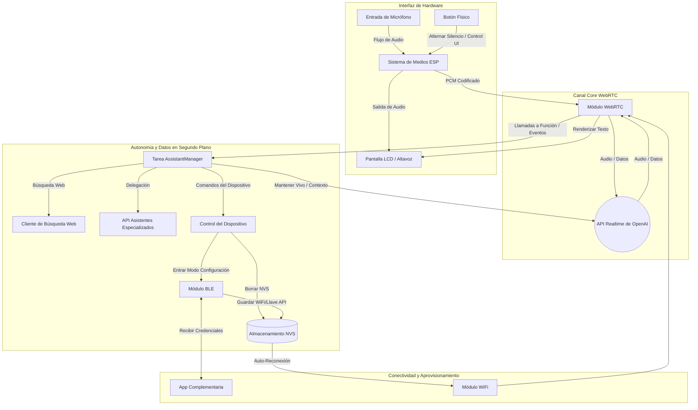

# 🧠 esp-drsimi (Asistente de IA para ESP32-S3-BOX3)

*Leer en [Inglés](README.md)*

Un framework WebRTC avanzado y rico en funciones para ESP32, optimizado específicamente para comunicación con IA en tiempo real. Este proyecto está construido sobre la base de [Espressif WebRTC Solution (OpenAI Demo)](https://github.com/espressif/esp-webrtc-solution/tree/main/solutions/openai_demo) y la expande con muchas más funcionalidades, comportamientos proactivos e integraciones personalizadas.

**Dr. SimiBot** es un asistente de IA conversacional en tiempo real impulsado por la **API Realtime de OpenAI** ejecutándose en un **ESP32‑S3‑BOX3**. El proyecto integra detección de presencia de doble factor (radar Wi-Fi CSI + BLE), captura y reproducción de audio de baja latencia, transmisión WebRTC, aprovisionamiento vía BLE, reconexión automática de WiFi y una interfaz gráfica en pantalla (LCD UI) en un sistema embebido compacto.

Dr. SimiBot es un personaje juguetón que habla español, inspirado en la mascota mexicana *Doctor Simi*. El asistente está diseñado para ser amigable, conciso y divertido, y también para comportarse de manera sensata cuando se le pide que guarde silencio — manteniendo la sesión activa y comunicándose mediante texto en la pantalla cuando es necesario.

---

## ⚙️ Características Principales

- 📡 **Detección de Presencia de Doble Factor (CSI + BLE)** — utiliza DSP determinista sobre la Información de Estado del Canal (CSI) de Wi-Fi para detectar movimiento físico como radar, combinada con la proximidad BLE de un smartphone autorizado para validar la identidad del usuario antes de despertar al asistente.
- 🎙️ **Conversación en tiempo real** utilizando la **API Realtime** de OpenAI vía WebRTC (impulsado por el modelo **gpt-realtime-2**).
- 🎧 **Control dinámico de audio** — activa o desactiva el silencio con una estrategia robusta de reinicio de la tubería de audio.
- 🤫 **Modo Silencio Inteligente** — cuando el usuario pide al asistente que guarde silencio, este silencia el micrófono pero mantiene activa la sesión, pudiendo enviar mensajes cortos de solo texto a la pantalla.
- 💡 **Sistema de eventos internos** que proporciona seudo-eventos útiles (`keep.alive`, `system.message.create`) mapeados a eventos reales de la API Realtime.
- 🔵 **Cliente/Servidor BLE** para el aprovisionamiento de credenciales WiFi y comandos remotos.
- 📶 **Reconexión WiFi automática** tras recibir nuevas credenciales vía BLE (no requiere reinicio físico).
- 📺 **Interfaz gráfica en pantalla (LCD UI)** con un mapa de caracteres adaptado y una capa de desinfección (sanitization) para hardware con juego de caracteres limitado.
- 🧩 **Código base modular** utilizando tareas de FreeRTOS para medios, WebRTC, UI, BLE y gestión del asistente.

### 🧠 Autonomía de IA y Tareas en Segundo Plano
El asistente cuenta con un conjunto robusto de funciones en segundo plano para controlar el dispositivo y obtener datos:
- **Búsqueda Web**: Capacidades de búsqueda en la web en tiempo real para obtener información actualizada.
- **Delegación de Asistente**: Transfiere consultas especializadas (ej. datos médicos o de productos) a un asistente de IA secundario (`get_assistants_help`).
- **Configuración del Dispositivo**: La IA puede poner el dispositivo en modo de configuración BLE si se le solicita (`enter_config_mode`).
- **Gestión de Memoria**: La IA puede borrar de forma segura las credenciales WiFi (`delete_credentials`) y la clave API de OpenAI (`delete_api_key`) de la memoria persistente del dispositivo (NVS).

### 🔐 Detección de Presencia de Doble Factor (CSI + BLE)
El sistema emplea un mecanismo de autenticación de doble capa altamente personalizado para detectar presencia y validar la identidad antes de despertar al asistente:
- **Wi-Fi CSI DSP (Movimiento)**: Un segundo ESP32-S3 actúa como baliza de radar y captura bloques LTF HT20 completos (`128` bytes, `64` subportadoras complejas). El firmware enmascara subportadoras ruidosas de borde y DC, realiza saneamiento/limpieza de fase eliminando deriva de reloj y CFO mediante ajuste lineal de mínimos cuadrados ponderados, y dispara eventos de movimiento de forma determinista usando métricas normalizadas de Caída de Correlación y Energía de Fase.
- **Proximidad BLE (Identidad)**: Una aplicación de smartphone personalizada llamada **"Nexus"** opera como un servicio en segundo plano ininterrumpible, convirtiendo el teléfono en una llave digital invisible. Transmite continuamente un UUID secreto a través de BLE, incluso cuando el teléfono está bloqueado o en reposo. Cuando el ESP32 principal detecta este UUID específico cerca, confirma la identidad del propietario.

*En resumen: el radar CSI DSP detecta que **alguien se movió**, y la baliza BLE Nexus confirma que eres **tú**.*

---

## 🧬 Arquitectura del Sistema



---

## 🗣️ Comandos de Voz y Ejemplos de Uso

Puedes controlar varias funciones del dispositivo simplemente hablando con el Dr. Simi. A continuación, algunos ejemplos en lenguaje natural:

- **Silenciar Micrófono**: 
  - *"Doctor, guarde silencio por un momento."*
  - **Acción**: Ejecuta `activate_mute`.
- **Apagar/Encender Pantalla**:
  - *"Doctor, apaga la pantalla."*
  - *"Doctor, enciende la pantalla."*
  - **Acción**: Ejecuta `control_display`.
- **Borrar Credenciales WiFi**: 
  - *"Doctor, borre las credenciales de la memoria."*
  - **Acción**: Ejecuta `delete_credentials`.
- **Eliminar Llave API**:
  - *"Doctor, elimina tu llave de acceso."*
  - **Acción**: Ejecuta `delete_api_key`.
- **Entrar en Modo Configuración BLE**:
  - *"Doctor, ponte en modo de configuración."*
  - **Acción**: Ejecuta `enter_config_mode`.
- **Búsqueda en la Web**:
  - *"Doctor, búscame las noticias más recientes sobre tecnología."*
  - **Acción**: Ejecuta `web_search`.
- **Consultar Asistente Especializado**:
  - *"¿Cuánto cuesta el paracetamol?"*
  - **Acción**: Ejecuta `get_assistants_help`.

---

## 🧩 Sistema de Eventos Internos

Este proyecto define un pequeño conjunto interno de tipos de eventos que son convenientes de usar desde el firmware. Por conveniencia, algunos de ellos son *seudo-eventos* que `sendEvent()` traduce al evento correspondiente de la API Realtime antes de enviarlos por el canal de datos WebRTC.

| Tipo de Evento             | Descripción | Enviado Como | Propósito |
| -------------------------- | ----------- | ------------ | --------- |
| `conversation.item.create` | Agrega un elemento a la conversación | `conversation.item.create` | Mensajes normales o salidas de funciones que deben formar parte del historial |
| `system.message.create`    | Inserta un mensaje originado por el sistema | `conversation.item.create` (role: `system`) | Agregar notificaciones cortas del sistema o contexto |
| `response.create`          | Solicita al modelo que genere una respuesta | `response.create` | Activar la inferencia del modelo |
| `keep.alive`               | Abreviatura interna para un ping corto de texto | `response.create` | Mantener viva la sesión durante períodos largos de silencio |

---

## 🧠 Flujo de Conversación (Ejemplo)

A continuación, un ejemplo de cómo se registra y actúa en la conversación un flujo corto para silenciar el dispositivo.

| Paso | Evento (cliente → servidor) | Actor / Rol | Contenido | Notas |
| ---: | --------------------------- | ----------- | --------- | ----- |
| 1 | Mensaje de `user` | user | "Doctor, guarde silencio por un momento." | El usuario solicita silencio |
| 2 | Respuesta del modelo | assistant | "De acuerdo, Lorenzo. Me quedaré calladito y escucharé." | El asistente confirma y se agrega al historial |
| 3 | `conversation.item.create` | device (system) | "Microphone muted successfully." | El dispositivo confirma la función / estado |
| 4 | `keep.alive` → `response.create` | device | "Inform user that microphone has been muted successfully." | El dispositivo solicita al modelo una nota textual corta |
| 5 | Salida de texto del modelo | assistant | "Sigo aquí, escuchando en silencio." | El modelo emite `response.output_text.delta/done` |

---

## 🔧 Aspectos Destacados de la Implementación

- **Manejo de silenciar/desilenciar**: Cuando el hardware silencia el micrófono, la tubería de audio se apaga de forma segura. Al desilenciar, se reinicia la tubería de captura.
- **Botón Alternador**: El botón físico funciona como un interruptor. El manejador elimina rebotes y coordina el hardware, el estado del códec y el reinicio de WebRTC si es necesario.
- **IDs de Llamada (Call IDs) y Funciones**: Cuando ocurren operaciones tipo función, el dispositivo guarda un `call_id` y lo adjunta a los eventos `conversation.item.create`.
- **Sanitización de UI**: La fuente de la pantalla LCD es un mapa de bits limitado de 8×8. El firmware desinfecta el texto UTF-8 proveniente del modelo, mapeando los caracteres que la pantalla no puede renderizar.
- **Inicialización Segura de Medios y Liberación de Recursos**: Para prevenir la corrupción de memoria y el agotamiento del heap, NimBLE se apaga explícitamente en un estado dedicado (`STATE_RELEASING_BLE`) antes de iniciar los entornos de ejecución de WebRTC y audio. El firmware también protege todas las interacciones de audio con estrictas comprobaciones `media_sys_is_ready()` para evitar fallos por condiciones de carrera.

---

## 🧰 Compilación y Configuración

1. **Requisitos de Hardware**:
   - **Dispositivo Principal**: Un ESP32-S3-BOX-3 (recomendado) para la IA y procesamiento de audio.
   - **Baliza CSI (Beacon)**: Un segundo ESP32-S3 (cualquier modelo) utilizado exclusivamente para recopilar los datos del radar Wi-Fi.
   - **Llave Digital**: Un smartphone Android ejecutando la aplicación personalizada "Nexus" en segundo plano para la validación BLE.
2. **Requisitos de Software**: ESP-IDF v5.4.3.
3. **Configuración**: Utiliza la aplicación complementaria en Flutter desde [lmartinez51/credentials](https://github.com/lmartinez51/credentials) para aprovisionar el dispositivo. La app se conecta vía BLE para enviar de forma segura las credenciales WiFi y la Llave API de OpenAI.

### Pasos rápidos de compilación

```bash
# establecer objetivo y configurar
idf.py set-target esp32s3
idf.py menuconfig    # configurar WiFi, BLE y credenciales OpenAI

# compilar y grabar
idf.py build
idf.py -p <PORT> flash monitor
```

> Consejo: Utiliza el `menuconfig` de ESP-IDF para almacenar tu llave de OpenAI en las opciones de almacenamiento seguro o variables de entorno dependiendo de tus requisitos de seguridad.

---

## 📁 Estructura del Proyecto (Alto Nivel)

```
/solutions/openai_demo/main
 ├── audio/                # Captura/reproducción de audio, tuberías y silencio
 ├── ble/                  # Lógica BLE central y aprovisionamiento
 ├── config/               # Gestor de ajustes y configuración NVS
 ├── core/                 # Aplicación principal y orquestación de alto nivel
 ├── hardware/             # Códec/I2C, botón y periféricos de placa
 ├── openai/               # Asistentes, búsqueda web y señalización Realtime
 ├── sensing/              # Detección de movimiento CSI con DSP puro
 ├── ui/                   # Renderizado LCD, mapeo de caracteres y UI
 └── webrtc/               # Integración WebRTC y manejo de eventos
```

---

## 🧪 Depuración y Logs

- El proyecto registra eventos internos usando las macros `ESP_LOG*`. Durante el desarrollo, `idf.py monitor` es de gran utilidad.
- Detalles importantes a observar: apertura/cierre del canal de datos WebRTC, `response.created` / `response.done`, `response.output_text.delta` y `response.output_text.done`.

---

## 📜 Licencia

Licencia MIT © 2025 Lorenzo Martinez

---

## 👨‍💻 Autor

Lorenzo Martinez - creador y mantenedor. Construido sobre los ejemplos de WebRTC de Espressif y la API Realtime de OpenAI.
*Construido con ❤️ para la comunidad ESP32.*
