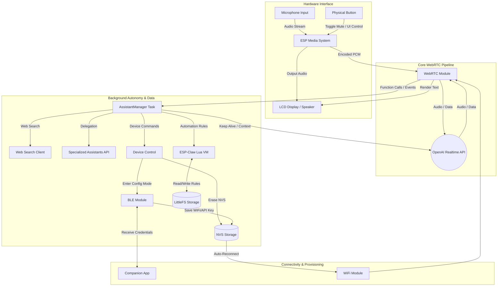

# 🧠 esp32s3-camila (ESP32-S3-BOX3 AI Chatbot)

*Read this in [Spanish](README-es.md)*

<p align="center">
  
</p>

An advanced and feature-rich WebRTC framework for ESP32, specifically optimized for real-time AI communication. This project is built upon the base of the [Espressif WebRTC Solution (OpenAI Demo)](https://github.com/espressif/esp-webrtc-solution/tree/main/solutions/openai_demo) and extends it with significantly more functionality, proactive behaviors, and custom integrations.

**Camila** is a real-time conversational AI assistant powered by the **OpenAI Realtime API** and running on an **ESP32‑S3‑BOX3**. The project integrates two-factor presence detection (Wi-Fi CSI radar + BLE), low-latency audio capture and playback, WebRTC streaming, BLE-driven provisioning, WiFi auto-reconnect, and an on-device LCD UI into a compact embedded system.

Camila is a sarcastic, highly energetic Spanish-speaking persona with a Mexican accent modeled after Lorenzo's best friend *Giovanna Ortiz*. The assistant is designed to be friendly, brief, and humorous, and also to behave sensibly when asked to be silent — keeping the session alive and communicating via text on the display when necessary.

---

## ⚙️ Key Features

- 📡 **Presence Detection & Beacon (BLE & ESP-NOW)** — uses BLE proximity of an authorized smartphone to validate the user's identity before waking up the assistant. It also functions as an ESP-NOW beacon, sending on-demand UDP packets to other devices.
- 🎙️ **Realtime conversation** using the OpenAI **Realtime API** via WebRTC (powered by the **gpt-realtime-2.1** model).
- 🎧 **Dynamic audio control** — toggle mute/unmute with a robust pipeline restart strategy.
- 🤫 **Smart Silent Mode** — when the user asks the assistant to stay quiet, it mutes audio but keeps the session active and can post short text-only messages to the conversation/display.
- 💡 **Internal event system** that provides convenient pseudo-events (`keep.alive`, `system.message.create`) mapped to real Realtime API events.
- 🔵 **BLE** client/server for WiFi credential provisioning and remote commands.
- 📶 **Auto WiFi reconnection** after receiving new credentials over BLE (no physical reboot required).
- 📺 **On-device LCD UI** with a tailored character map, procedural dynamic outfits for Camila (e.g. Camila, Mexico National Team, Chapulín Colorado, FC Barcelona), and hardware-accelerated rendering optimizations (dirty rect restore).
- 🦎 **ESP-Claw Lua Engine** — an embedded Lua 5.4 Virtual Machine (`esp_claw_init`) isolated in its own FreeRTOS task, enabling dynamic script execution, rapid logic prototyping without blocking the main WebRTC C-loop.
- 🧩 **Modular code base** using FreeRTOS tasks for media, WebRTC, UI, BLE, and assistant management.

### 🧠 AI Autonomy & Background Tasks
The chatbot has access to a robust set of background functions to control the device and fetch data:
- **Web Search**: Real-time web search capabilities for fetching up-to-date information.
- **Product Lookup**: Consults an external API to retrieve detailed information and prices about specific products (`lookup_product_info`).
- **Device Configuration**: The AI can switch the device into BLE configuration mode upon request (`enter_config_mode`).
- **Memory Management**: The AI can securely erase WiFi credentials (`delete_credentials`) and the OpenAI API Key (`delete_api_key`) from the device's persistent memory (NVS).

### 🔐 Presence Detection & Beacon (BLE + ESP-NOW)
The system employs a customized authentication mechanism to validate identity before waking up the assistant:
- **BLE Proximity (Identity)**: A custom smartphone app called **"Nexus"** operates as an unstoppable background service, turning the phone into an invisible digital key. It continuously broadcasts a secret UUID over BLE, even when the phone is locked or dozing. When Camila detects this specific UUID nearby, she confirms your identity.
- **ESP-NOW UDP Beacon**: Camila can also function as a beacon on-demand, sending UDP packets via ESP-NOW to communicate with or wake up other devices in the ecosystem.

---

## 🧬 System Architecture



---

## 🦎 ESP-Claw Automation Engine (Lua)

A key feature of the Camila architecture is its embedded **ESP-Claw Lua 5.4 Virtual Machine**, operating in an isolated FreeRTOS task. It empowers the AI to not just execute hardcoded commands, but to program its own logic and store complex automation rules directly on the device's LittleFS partition.

Through natural language, the AI translates your requests into JSON commands which the C orchestrator intercepts and delegates to the Lua VM. You can interact with this engine seamlessly:

- **Create**: 
  > *"Camila, crea una regla de automatización que cuando se active el trigger 'luces', envíes un paquete UDP para prender las luces."*
  (Camila generates the rule and confirms it instantly).
- **Execute**:
  > *"Camila, ejecuta la regla 'luces'."*
  (The orchestrator queues the execution in Lua using coroutines to avoid blocking, emits the UDP packet, and confirms success).
- **Read**: 
  > *"Camila, ¿qué reglas de automatización tienes guardadas en la memoria ahorita?"*
  (The orchestrator pauses, Lua reads the dictionary, returns "luces" to C, and Camila speaks it out loud).
- **Delete**: 
  > *"Excelente Camila, ahora por favor borra la regla de 'luces'."*
  (Lua receives the `SYS_CMD:DELETE` command, destroys the dictionary key, and confirms the deletion).
- **Verify**: 
  > *"Camila, ¿qué reglas te quedan activas?"*
  (Camila will confirm the memory is empty).

---

## 🗣️ Voice Commands & Usage Examples

You can control various device features simply by talking to Camila. Here are some natural language examples in Mexican Spanish (with English context):

- **Mute Microphone**: 
  - *"Camila, guarde silencio por un momento."* (Context: "Camila, mute yourself for a sec.")
  - **Action**: Triggers `activate_mute`.
- **Turn Off/On Screen**:
  - *"Camila, apaga la pantalla."* (Context: "Camila, turn the screen off.")
  - *"Camila, enciende la pantalla."* (Context: "Camila, wake the screen up.")
  - **Action**: Triggers `control_display`.
- **Erase WiFi Credentials**: 
  - *"Camila, borre las credenciales de la memoria."* (Context: "Camila, forget all the saved Wi-Fi networks.")
  - **Action**: Triggers `delete_credentials`.
- **Delete API Key**:
  - *"Camila, elimina tu llave de acceso."* (Context: "Camila, wipe your API key.")
  - **Action**: Triggers `delete_api_key`.
- **Enter BLE Config Mode**:
  - *"Camila, ponte en modo de configuración."* (Context: "Camila, switch over to setup mode.")
  - **Action**: Triggers `enter_config_mode`.
- **Search the Web**:
  - *"Camila, búscame las noticias más recientes sobre tecnología."* (Context: "Camila, pull up the latest tech news.")
  - **Action**: Triggers `web_search`.
- **Product Information Lookup**:
  - *"¿Cuánto cuesta el paracetamol?"* (Context: "How much does Tylenol usually go for?")
  - **Action**: Triggers `lookup_product_info`.
- **Change Outfit**:
  - *"Camila, ponte tu vestido elegante."* (Context: "Camila, put on your elegant dress.")
  - *"Camila, ponte tu chaqueta de cuero."* (Context: "Camila, put on your leather jacket.")
  - *"Camila, ponte tu ropa casual."* (Context: "Camila, put on your casual clothes.")
  - **Action**: Triggers `change_simi_outfit`.

---

## 🧩 Internal Event System

This project defines a small internal set of event types that are convenient to use from the firmware. For convenience, some of them are *pseudo-events* that `sendEvent()` translates into the proper Realtime API event before sending over the WebRTC data channel.

| Event Type                 | Description | Sent As | Purpose |
| -------------------------- | ----------- | ------- | ------- |
| `conversation.item.create` | Add an item to the conversation | `conversation.item.create` | Normal user/assistant or function outputs that should be part of the history |
| `system.message.create`    | Insert a system-originated message | `conversation.item.create` (role: `system`) | Add short system notices or context messages |
| `response.create`          | Request the model to produce a response | `response.create` | Trigger model inference |
| `keep.alive`               | Internal shorthand for a short, text-only ping | `response.create` | Keep the session alive during long silent periods |

---

## 🧠 Conversation Flow (example)

Below is an example of how a short mute flow is recorded and acted on in the conversation.

| Step | Event (client → server) | Actor / Role | Content | Notes |
| ---: | ----------------------- | ------------ | ------- | ----- |
| 1 | `user` message | user | "Camila, please stay quiet." | User requests silence |
| 2 | Model response | assistant | "Alright, Lorenzo. I’ll stay quiet and listen for a bit." | Assistant confirms and is added to history |
| 3 | `conversation.item.create` | device (system) | "Microphone muted successfully." | Device confirms function call / status |
| 4 | `keep.alive` → `response.create` | device | "Inform user that microphone has been muted successfully." | Device asks model to return a short textual notice |
| 5 | Model text output | assistant | "Still here — quietly listening." | Model emits `response.output_text.delta/done` |

---

## 🔧 Implementation Highlights

- **Mute/unmute handling**: The central orchestrator manages the global mute state, safely shutting down the pipeline when muting and seamlessly restarting it upon unmuting, while keeping the WebRTC session informed.
- **Toggle Button**: The physical push button acts as a toggle. The handler debounces and coordinates hardware and codec state, delegating UI and WebRTC restart synchronization to the orchestrator.
- **Call IDs & Function Calls**: When function-like operations occur, the device stores a `call_id` and attaches it to the `conversation.item.create` events.
- **UI sanitization**: The LCD font set is a limited 8×8 bitmap. The firmware sanitizes UTF-8 text from the model, mapping characters the display can't render.
- **Safe Media Initialization & Resource Teardown**: To prevent memory corruption and heap exhaustion, NimBLE is explicitly shut down in a dedicated state (`STATE_RELEASING_BLE`) before igniting the WebRTC and audio runtimes. The firmware also guards all audio interactions with strict `media_sys_is_ready()` checks to avoid crashing during race conditions.

---

## 🧰 Build & Setup

1. **Hardware Prerequisites**:
   - **Main Device**: An ESP32-S3-BOX-3 (recommended) for AI and audio processing.
   - **Digital Key**: An Android smartphone running the custom "Nexus" background app for BLE validation.
2. **Software Prerequisites**: ESP-IDF v5.4.3.
3. **Configuration**: Use the companion Flutter app from [lmartinez51/credentials](https://github.com/lmartinez51/credentials) to provision the device. The app connects via BLE to securely send the WiFi credentials and the OpenAI API Key.

### Quick build steps

```bash
# set target and configure
idf.py set-target esp32s3
idf.py menuconfig    # configure WiFi, BLE, and OpenAI credentials

# build & flash
idf.py build
idf.py -p <PORT> flash monitor
```

> Tip: Use the ESP-IDF `menuconfig` to store your OpenAI key in the secure storage options or env variables depending on your security posture.

---

## 📁 Project Layout (high level)

```
/solutions/openai_camila/main
 ├── alert/                # Alert dispatcher
 ├── audio/                # Audio capture/playback, pipeline control, and mute logic
 ├── ble/                  # BLE central logic and provisioning
 ├── config/               # Settings manager, NVS setup
 ├── core/                 # Main app and high-level orchestration
 ├── hardware/             # Codec/I2C init, board peripherals
 ├── openai/               # Assistant logic, Web Search, Realtime API signaling
 ├── ui/                   # LCD rendering, charset mapping, and UI logic
 └── webrtc/               # WebRTC integration and event handling
```

---

## 🧪 Debugging & Logs

- The project logs internal events using `ESP_LOG*` macros. During development, `idf.py monitor` is your friend.
- Important things to watch for: WebRTC data channel open/close, `response.created` / `response.done`, `response.output_text.delta` and `response.output_text.done`.

---

## 📜 License

MIT License © 2025 Lorenzo Martinez

---

## 👨‍💻 Author

Lorenzo Martinez - creator & maintainer. Built on top of Espressif's WebRTC examples and the OpenAI Realtime API.
*Built with ❤️ for the ESP32 Community.*
