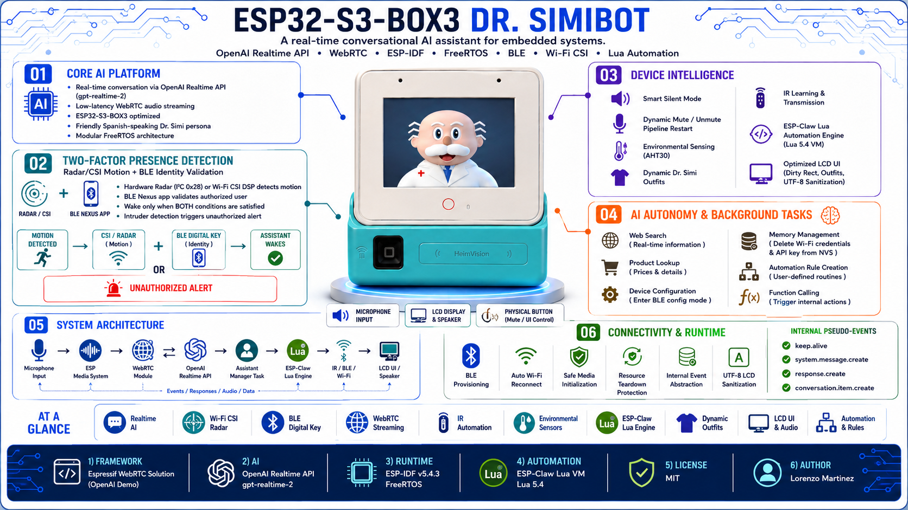
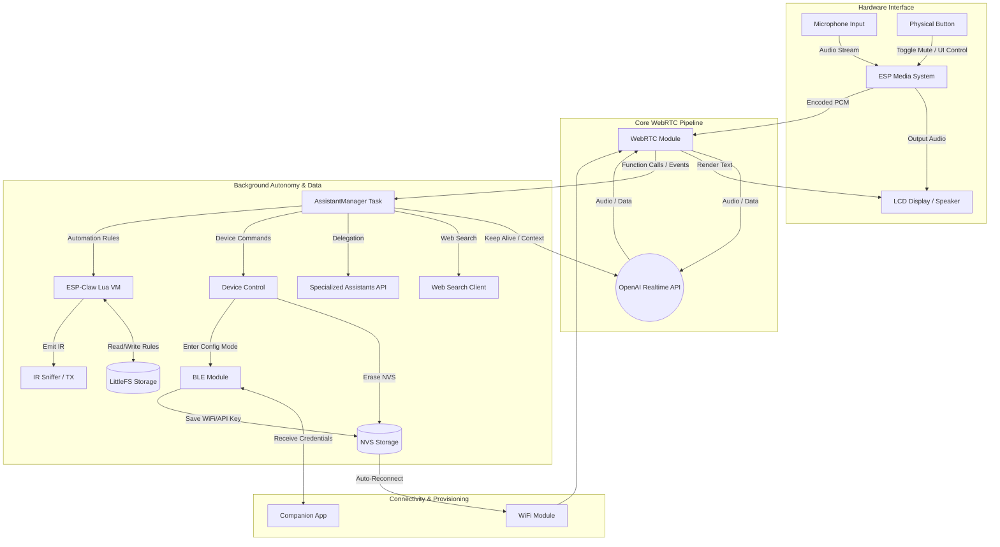

# 🧠 esp-drsimi (ESP32-S3-BOX3 AI Chatbot)

*Read this in [Spanish](README-es.md)*

<p align="center">
  
</p>

An advanced and feature-rich WebRTC framework for ESP32, specifically optimized for real-time AI communication. This project is built upon the base of the [Espressif WebRTC Solution (OpenAI Demo)](https://github.com/espressif/esp-webrtc-solution/tree/main/solutions/openai_demo) and extends it with significantly more functionality, proactive behaviors, and custom integrations.

**Dr. SimiBot** is a real-time conversational AI assistant powered by the **OpenAI Realtime API** and running on an **ESP32‑S3‑BOX3**. The project integrates two-factor presence detection (Wi-Fi CSI radar + BLE), low-latency audio capture and playback, WebRTC streaming, BLE-driven provisioning, WiFi auto-reconnect, and an on-device LCD UI into a compact embedded system.

Dr. SimiBot is a playful, Spanish-speaking persona inspired by the Mexican mascot *Doctor Simi*. The assistant is designed to be friendly, brief, and humorous, and also to behave sensibly when asked to be silent — keeping the session alive and communicating via text on the display when necessary.

---

## ⚙️ Key Features

- 📡 **Two-Factor Presence Detection (Radar/CSI + BLE)** — uses an optional hardware radar or deterministic Wi-Fi CSI DSP for motion sensing, combined with BLE proximity of an authorized smartphone to validate the user's identity before waking up the assistant.
- 📡 **IR Sniffer Integration** — capture and map infrared remote commands to trigger internal actions (e.g., mute/unmute) when docked.
- 🎙️ **Realtime conversation** using the OpenAI **Realtime API** via WebRTC (powered by the **gpt-realtime-2** model).
- 🎧 **Dynamic audio control** — toggle mute/unmute with a robust pipeline restart strategy.
- 🤫 **Smart Silent Mode** — when the user asks the assistant to stay quiet, it mutes audio but keeps the session active and can post short text-only messages to the conversation/display.
- 💡 **Internal event system** that provides convenient pseudo-events (`keep.alive`, `system.message.create`) mapped to real Realtime API events.
- 🔵 **BLE** client/server for WiFi credential provisioning and remote commands.
- 📶 **Auto WiFi reconnection** after receiving new credentials over BLE (no physical reboot required).
- 📺 **On-device LCD UI** with a tailored character map, procedural dynamic outfits for Dr. Simi (e.g. Doctor, Mexico National Team, Chapulín Colorado, FC Barcelona), and hardware-accelerated rendering optimizations (dirty rect restore).
- 🌡️ **Environmental Sensing** — real-time temperature and humidity monitoring via I2C (AHT30), rendered directly on the LCD UI.
- 🦎 **ESP-Claw Lua Engine** — an embedded Lua 5.4 Virtual Machine (`esp_claw_init`) isolated in its own FreeRTOS task, enabling dynamic script execution, rapid logic prototyping, and hardware-accelerated IR processing (`lua_ir_bindings`) without blocking the main WebRTC C-loop.
- 🧩 **Modular code base** using FreeRTOS tasks for media, WebRTC, UI, BLE, and assistant management.

### 🧠 AI Autonomy & Background Tasks
The chatbot has access to a robust set of background functions to control the device and fetch data:
- **Web Search**: Real-time web search capabilities for fetching up-to-date information.
- **Product Lookup**: Consults an external API to retrieve detailed information and prices about specific products (`lookup_product_info`).
- **Device Configuration**: The AI can switch the device into BLE configuration mode upon request (`enter_config_mode`).
- **Memory Management**: The AI can securely erase WiFi credentials (`delete_credentials`) and the OpenAI API Key (`delete_api_key`) from the device's persistent memory (NVS).

### 🔐 Two-Factor Presence Detection (Radar/CSI + BLE)
The system employs a highly customized, dual-layer authentication mechanism to detect presence and validate identity before waking up the assistant:
- **Motion Detection (Hardware Radar or Wi-Fi CSI)**: The system supports an optional external I2C hardware radar (at 0x28) for high-precision presence detection. If unavailable, it falls back to a secondary ESP32-S3 acting as a Wi-Fi CSI radar beacon that captures full HT20 CSI LTF blocks (`128` bytes, `64` complex subcarriers). The firmware masks noisy edge and DC subcarriers, performs Phase Sanitization / Phase Cleaning by removing clock drift and CFO with a weighted least-squares linear phase fit, and triggers motion deterministically from normalized Correlation Drop and Phase Energy metrics.
- **BLE Proximity (Identity)**: A custom smartphone app called **"Nexus"** operates as an unstoppable background service, turning the phone into an invisible digital key. It continuously broadcasts a secret UUID over BLE, even when the phone is locked or dozing. When the primary ESP32 detects this specific UUID nearby, it confirms the owner's identity.

*In short: the radar (Hardware or CSI DSP) detects that **someone moved**, and the BLE Nexus beacon confirms that it is **you**.*

- **🚨 Intruder Alert (Alert Dispatcher)**: If the radar (Hardware or CSI DSP) detects physical motion but the authorized BLE Nexus beacon is **NOT** present to validate your identity, the system immediately registers an unauthorized access attempt. The `alert_dispatcher` then triggers an alert event, notifying you (or the WebRTC/OpenAI session) that an unrecognized presence was detected.

---

## 🧬 System Architecture



---

## 🦎 ESP-Claw Automation Engine (Lua)

A key feature of the Dr. SimiBot architecture is its embedded **ESP-Claw Lua 5.4 Virtual Machine**, operating in an isolated FreeRTOS task. It empowers the AI to not just execute hardcoded commands, but to program its own logic and store complex automation rules directly on the device's LittleFS partition.

Through natural language, the AI translates your requests into JSON commands which the C orchestrator intercepts and delegates to the Lua VM. You can interact with this engine seamlessly:

- **Create**: 
  > *"Doctor, crea una regla de automatización que cuando se active el trigger 'ver ovnis', prendas la TV, pongas el canal 3.3 y le subas al volumen."*
  (Dr. Simi generates the rule and confirms it instantly).
- **Execute**:
  > *"Doctor, ejecuta la regla 'ver ovnis'."*
  (The orchestrator queues the execution in Lua using coroutines to avoid blocking, emits the IR commands sequentially, and confirms success).
- **Read**: 
  > *"Doctor, ¿qué reglas de automatización tienes guardadas en la memoria ahorita?"*
  (The orchestrator pauses, Lua reads the dictionary, returns "ver_ovnis" to C, and Dr. Simi speaks it out loud).
- **Delete**: 
  > *"Excelente doctor, ahora por favor borra la regla de 'ver ovnis'."*
  (Lua receives the `SYS_CMD:DELETE` command, destroys the dictionary key, and confirms the deletion).
- **Verify**: 
  > *"Doctor, ¿qué reglas te quedan activas?"*
  (Dr. Simi will confirm the memory is empty).

---

## 🗣️ Voice Commands & Usage Examples

You can control various device features simply by talking to Dr. Simi. Here are some natural language examples in Mexican Spanish (with English context):

- **Mute Microphone**: 
  - *"Doctor, guarde silencio por un momento."* (Context: "Doc, mute yourself for a sec.")
  - **Action**: Triggers `activate_mute`.
- **Turn Off/On Screen**:
  - *"Doctor, apaga la pantalla."* (Context: "Doc, turn the screen off.")
  - *"Doctor, enciende la pantalla."* (Context: "Doc, wake the screen up.")
  - **Action**: Triggers `control_display`.
- **Erase WiFi Credentials**: 
  - *"Doctor, borre las credenciales de la memoria."* (Context: "Doc, forget all the saved Wi-Fi networks.")
  - **Action**: Triggers `delete_credentials`.
- **Delete API Key**:
  - *"Doctor, elimina tu llave de acceso."* (Context: "Doc, wipe your API key.")
  - **Action**: Triggers `delete_api_key`.
- **Enter BLE Config Mode**:
  - *"Doctor, ponte en modo de configuración."* (Context: "Doc, switch over to setup mode.")
  - **Action**: Triggers `enter_config_mode`.
- **Search the Web**:
  - *"Doctor, búscame las noticias más recientes sobre tecnología."* (Context: "Doc, pull up the latest tech news.")
  - **Action**: Triggers `web_search`.
- **Product Information Lookup**:
  - *"¿Cuánto cuesta el paracetamol?"* (Context: "How much does Tylenol usually go for?")
  - **Action**: Triggers `lookup_product_info`.
- **Change Outfit**:
  - *"Doctor, póngase su traje de superhéroe."* (Context: "Doc, put on your superhero suit.")
  - *"Doctor, póngase la playera de la selección."* (Context: "Doc, put on the national team jersey.")
  - *"Doctor, ponte la camisa del Barça."* (Context: "Doc, put on the FC Barcelona jersey.")
  - **Action**: Triggers `change_simi_outfit`.
- **Control Electronic Devices (IR)**:
  - *"Doctor, enciende la tele."* (Context: "Doc, turn on the TV.")
  - *"Doctor, apréndete el botón de encendido de la tele."* (Context: "Doc, learn the TV power button.")
  - *"Doctor, guarda los códigos infrarrojos."* (Context: "Doc, save the IR codes.")
  - *"Doctor, ¿qué dispositivos infrarrojos tienes registrados?"* (Context: "Doc, what IR devices do you have registered?")
  - **Action**: Triggers `ir_transmit_command`, `ir_learn_button`, `ir_save_database`, or `ir_get_devices`.

---

## 🧩 Internal Event System

This project defines a small internal set of event types that are convenient to use from the firmware. For convenience, some of them are *pseudo-events* that `sendEvent()` translates into the proper Realtime API event before sending over the WebRTC data channel.

| Event Type                 | Description | Sent As | Purpose |
| -------------------------- | ----------- | ------- | ------- |
| `conversation.item.create` | Add an item to the conversation | `conversation.item.create` | Normal user/assistant or function outputs that should be part of the history |
| `system.message.create`    | Insert a system-originated message | `conversation.item.create` (role: `system`) | Add short system notices or context messages |
| `response.create`          | Request the model to produce a response | `response.create` | Trigger model inference |
| `keep.alive`               | Internal shorthand for a short, text-only ping | `response.create` | Keep the session alive during long silent periods |

---

## 🧠 Conversation Flow (example)

Below is an example of how a short mute flow is recorded and acted on in the conversation.

| Step | Event (client → server) | Actor / Role | Content | Notes |
| ---: | ----------------------- | ------------ | ------- | ----- |
| 1 | `user` message | user | "Doctor, please stay quiet." | User requests silence |
| 2 | Model response | assistant | "Alright, Lorenzo. I’ll stay quiet and listen for a bit." | Assistant confirms and is added to history |
| 3 | `conversation.item.create` | device (system) | "Microphone muted successfully." | Device confirms function call / status |
| 4 | `keep.alive` → `response.create` | device | "Inform user that microphone has been muted successfully." | Device asks model to return a short textual notice |
| 5 | Model text output | assistant | "Still here — quietly listening." | Model emits `response.output_text.delta/done` |

---

## 🔧 Implementation Highlights

- **Mute/unmute handling**: The central orchestrator manages the global mute state, safely shutting down the pipeline when muting and seamlessly restarting it upon unmuting, while keeping the WebRTC session informed.
- **Toggle Button**: The physical push button acts as a toggle. The handler debounces and coordinates hardware and codec state, delegating UI and WebRTC restart synchronization to the orchestrator.
- **Call IDs & Function Calls**: When function-like operations occur, the device stores a `call_id` and attaches it to the `conversation.item.create` events.
- **UI sanitization**: The LCD font set is a limited 8×8 bitmap. The firmware sanitizes UTF-8 text from the model, mapping characters the display can't render.
- **Safe Media Initialization & Resource Teardown**: To prevent memory corruption and heap exhaustion, NimBLE is explicitly shut down in a dedicated state (`STATE_RELEASING_BLE`) before igniting the WebRTC and audio runtimes. The firmware also guards all audio interactions with strict `media_sys_is_ready()` checks to avoid crashing during race conditions.

---

## 🧰 Build & Setup

1. **Hardware Prerequisites**:
   - **Main Device**: An ESP32-S3-BOX-3 (recommended) for AI and audio processing.
   - **Dock Accessory**: An `ESP32-S3-BOX-3-SENSOR` dock. While not strictly required for the core voice assistant, this dock is necessary if you want to use the environmental temperature/humidity sensors (AHT30), the infrared (IR) sniffer/emitter, and the hardware presence radar.
   - **CSI Beacon**: A second ESP32-S3 (any variant) used exclusively to collect and broadcast Wi-Fi radar data.
   - **Digital Key**: An Android smartphone running the custom "Nexus" background app for BLE validation.
2. **Software Prerequisites**: ESP-IDF v5.4.3.
3. **Configuration**: Use the companion Flutter app from [lmartinez51/credentials](https://github.com/lmartinez51/credentials) to provision the device. The app connects via BLE to securely send the WiFi credentials and the OpenAI API Key.

### Quick build steps

```bash
# set target and configure
idf.py set-target esp32s3
idf.py menuconfig    # configure WiFi, BLE, and OpenAI credentials

# build & flash
idf.py build
idf.py -p <PORT> flash monitor
```

> Tip: Use the ESP-IDF `menuconfig` to store your OpenAI key in the secure storage options or env variables depending on your security posture.

---

## 📁 Project Layout (high level)

```
/solutions/openai_demo/main
 ├── alert/                # CSI drop/motion alert dispatcher
 ├── audio/                # Audio capture/playback, pipeline control, and mute logic
 ├── ble/                  # BLE central logic and provisioning
 ├── config/               # Settings manager, NVS setup
 ├── core/                 # Main app and high-level orchestration
 ├── hardware/             # Codec/I2C init, environmental (AHT30) and radar sensors, board peripherals
 ├── openai/               # Assistant logic, Web Search, Realtime API signaling
 ├── sensing/              # Pure DSP CSI motion detection
 ├── ui/                   # LCD rendering, charset mapping, and UI logic
 └── webrtc/               # WebRTC integration and event handling
```

---

## 🧪 Debugging & Logs

- The project logs internal events using `ESP_LOG*` macros. During development, `idf.py monitor` is your friend.
- Important things to watch for: WebRTC data channel open/close, `response.created` / `response.done`, `response.output_text.delta` and `response.output_text.done`.

---

## 📜 License

MIT License © 2025 Lorenzo Martinez

---

## 👨‍💻 Author

Lorenzo Martinez - creator & maintainer. Built on top of Espressif's WebRTC examples and the OpenAI Realtime API.
*Built with ❤️ for the ESP32 Community.*
