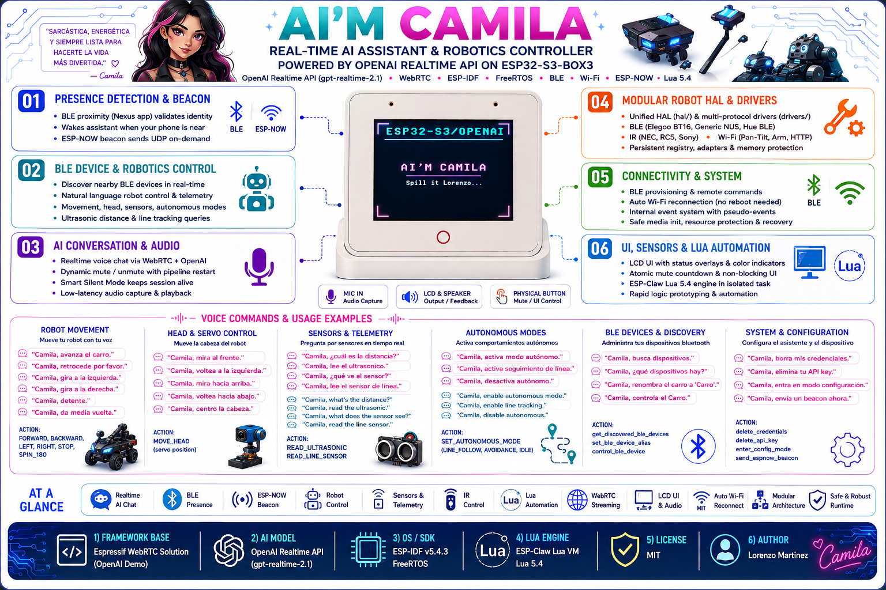
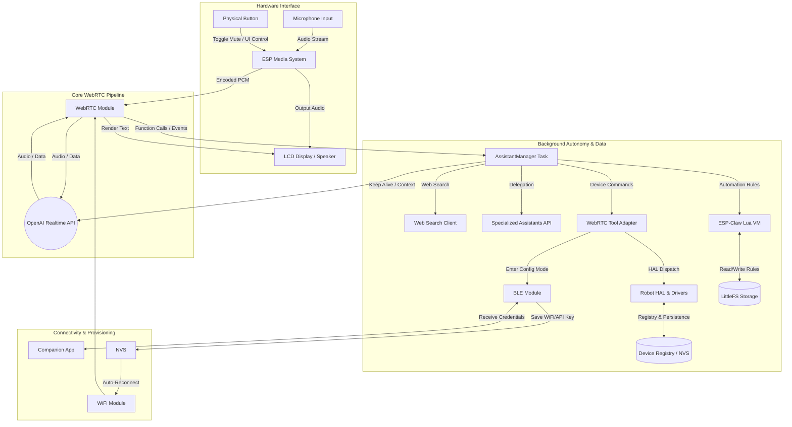

# 🧠 esp32s3-camila (ESP32-S3-BOX3 AI Chatbot)

*Read this in [Spanish](README-es.md)*

<p align="center">
  
</p>

An advanced and feature-rich WebRTC framework for ESP32, specifically optimized for real-time AI communication and multi-protocol hardware control. This project is built upon the base of the [Espressif WebRTC Solution (OpenAI Demo)](https://github.com/espressif/esp-webrtc-solution/tree/main/solutions/openai_demo) and extends it with significantly more functionality, proactive behaviors, custom robotics HAL drivers, and home automation integrations.

**Camila** is a real-time conversational AI assistant powered by the **OpenAI Realtime API** running on an **ESP32‑S3‑BOX3**. The project integrates BLE smartphone proximity identity validation, low-latency audio capture and playback, WebRTC streaming, a Modular Robot HAL ecosystem (supporting BLE robotics, Philips Hue BLE smart lighting, Universal IR remote control, and WiFi pan-tilt peripherals), BLE-driven provisioning, WiFi auto-reconnect, an embedded Lua 5.4 automation engine (ESP-Claw), and an on-device LCD UI into a compact embedded system.

Camila is a sarcastic, highly energetic Spanish-speaking persona with a Mexican accent. The assistant is designed to be friendly, brief, witty, and humorous, and also to behave sensibly when asked to be silent — keeping the session alive and communicating via text on the display when necessary.

---

## ⚙️ Key Features

- 📡 **BLE Proximity Identity & Vigilante Mode** — scans for an authorized smartphone running the "Nexus" companion app over BLE upon startup to validate the user's identity before unlocking conversation. If no authorized digital key is detected within the validation window, Camila enters Vigilante (Sentinel) Mode, issuing automated security warnings and asking unauthorized persons to leave immediately. It can also function as an ESP-NOW beacon on-demand.
- 🤖 **BLE Device & Robotics Natural Language Control & Telemetry** — real-time discovery of nearby Bluetooth devices, custom persistent NVS alias assignment (e.g. renaming ELEGOO BT16 to 'Carro'), natural language voice commands over WebRTC to control movement (FORWARD, BACKWARD, LEFT, RIGHT, STOP, SPIN_180), servo head movement (MOVE_HEAD), line tracking sensor queries (READ_LINE_SENSOR), autonomous mode switching (SET_AUTONOMOUS_MODE), and real-time ultrasonic sensor telemetry querying (READ_ULTRASONIC) for obstacle distance measurements.
- 🛠️ **Modular Robot HAL & Multi-Protocol Drivers** — unified hardware abstraction layer (`hal/`), driver ecosystem (`drivers/`) supporting BLE (Elegoo BT16, Generic NUS, Philips Hue BLE Smart Light), IR (RMT NEC, RC5, Sony), and WiFi (Pan-Tilt, Robotic Arm, HTTP/TCP), backed by internal memory floor protection, a persistent device registry (`registry/`), and dynamic WebRTC tool adapter (`adapters/`).
- 🎙️ **Realtime conversation** using the OpenAI **Realtime API** via WebRTC (powered by the **gpt-realtime-2.1** model).
- 🎧 **Dynamic audio control & Audio Watchdog** — toggle mute/unmute with a robust pipeline restart strategy and an automated FreeRTOS Audio Watchdog (`audio_watchdog.c`) monitoring I2S capture pipeline health.
- 🔐 **Thread-Safe Global NVS Guard** — unified recursive mutex (`nvs_guard`) protecting all concurrent NVS flash read/write operations across BLE profiles, IR learned codes, device registry, and WiFi credentials.
- 🤫 **Smart Silent Mode** — when the user asks the assistant to stay quiet, it mutes audio but keeps the session active and can post short text-only messages to the conversation/display.
- 💡 **Internal event system** that provides convenient pseudo-events (`keep.alive`, `system.message.create`) mapped to real Realtime API events.
- 🔵 **BLE** client/server for WiFi credential provisioning and remote commands.
- 📶 **Auto WiFi reconnection** after receiving new credentials over BLE (no physical reboot required).
- 📺 **On-device LCD UI** with a tailored character map, status overlays, atomic 1-pass non-blocking mute countdown bands, dynamic state color indicators, and hardware-accelerated rendering optimizations.
- 🦎 **ESP-Claw Lua Engine & Dynamic Skills** — an embedded Lua 5.4 Virtual Machine (`esp_claw_init`) isolated in its own FreeRTOS task, enabling dynamic script execution, autonomous choreography routines/skills (`run_skill`, e.g. `dance.lua`), and rapid logic prototyping without blocking the main WebRTC C-loop.
- 🧩 **Modular code base** using FreeRTOS tasks for media, WebRTC, UI, BLE, and assistant management.

### 🧠 AI Autonomy & Background Tasks
The chatbot has access to a robust set of background functions to control the device and fetch data:
- **Web Search**: Real-time web search capabilities for fetching up-to-date information.
- **Product Lookup**: Consults an external API to retrieve detailed information and prices about specific products (`lookup_product_info`).
- **Autonomous Skills & Choreography**: Executes specialized Lua skill routines (`run_skill`) such as robot dances and dynamic automations.
- **BLE Device Discovery & Control**: Queries surrounding Bluetooth devices (`get_discovered_ble_devices`), assigns friendly aliases saved to NVS (`set_ble_device_alias`), and dispatches motion/pulse commands to smart devices and robots (`control_ble_device`) with automatic keep-alive lifecycle management.
- **Device Configuration**: The AI can switch the device into BLE configuration mode upon request (`enter_config_mode`).
- **Memory Management**: The AI can securely erase WiFi credentials (`delete_credentials`) and the OpenAI API Key (`delete_api_key`) from the device's persistent memory (NVS).

### 🔐 BLE Identity Validation & Vigilante Mode (BLE + ESP-NOW)
The system employs a BLE proximity validation mechanism upon startup to verify the user's identity:
- **BLE Proximity Identity Validation**: A custom smartphone companion app called **"Nexus"** operates as a background service, turning the phone into an invisible digital key. It continuously broadcasts a secret UUID over BLE. When Camila powers on, she scans for this UUID to confirm your identity ("Lorenzo").
- **Vigilante (Sentinel) Mode**: If no authorized smartphone app is detected within the validation window upon startup, Camila enters Vigilante Mode (Protocol Zero active). In this state, conversation is locked, an alert tone sounds, and she instructs the unauthorized person to step away and leave the premises immediately.
- **ESP-NOW UDP Beacon**: Camila can also function as a beacon on-demand, sending UDP packets via ESP-NOW to communicate with or wake up other devices in the ecosystem.

---

## 🧬 System Architecture


```mermaid
flowchart TD
    subgraph Hardware Interface
        A[Microphone Input] -->|Audio Stream| B[ESP Media System]
        E[LCD Display / Speaker]
        F[Physical Button]
        B -->|Output Audio| E
    end

    subgraph Core WebRTC Pipeline
        B -->|Encoded PCM| C[WebRTC Module]
        C -->|Audio / Data| D((OpenAI Realtime API))
        D -->|Audio / Data| C
        C -->|Render Text| E
        F -->|Toggle Mute / UI Control| B
    end

    subgraph Background Autonomy & Data
        C -->|Function Calls / Events| G[AssistantManager Task]
        G -->|Keep Alive / Context| D
        G -->|Web Search| WS[Web Search Client]
        G -->|Delegation| SA[Specialized Assistants API]
        G -->|Device Commands| TA[WebRTC Tool Adapter]
        TA -->|HAL Dispatch| HAL[Robot HAL & Drivers]
        HAL <-->|Registry & Persistence| REG[(Device Registry / NVS)]
        TA -->|Enter Config Mode| BLE[BLE Module]
        G -->|Automation Rules| LUA[ESP-Claw Lua VM]
        LUA <-->|Read/Write Rules| LFS[(LittleFS Storage)]
    end

    subgraph Connectivity & Provisioning
        BLE <-->|Receive Credentials| App[Companion App]
        BLE -->|Save WiFi/API Key| NVS
        NVS -->|Auto-Reconnect| WiFi[WiFi Module]
        WiFi --> C
    end
```

---

## 🦎 ESP-Claw Automation Engine (Lua)

A key feature of the Camila architecture is its embedded **ESP-Claw Lua 5.4 Virtual Machine**, operating in an isolated FreeRTOS task. It empowers the AI to not just execute hardcoded commands, but to program its own logic and store complex automation rules directly on the device's LittleFS partition.

Through natural language, the AI translates your requests into JSON commands which the C orchestrator intercepts and delegates to the Lua VM. You can interact with this engine seamlessly:

- **Create**: 
  > *"Camila, crea una regla de automatización que cuando se active el trigger 'luces', envíes un paquete UDP para prender las luces."*
  (Camila generates the rule and confirms it instantly).
- **Execute**:
  > *"Camila, ejecuta la regla 'luces'."*
  (The orchestrator queues the execution in Lua using coroutines to avoid blocking, emits the UDP packet, and confirms success).
- **Read**: 
  > *"Camila, ¿qué reglas de automatización tienes guardadas en la memoria ahorita?"*
  (The orchestrator pauses, Lua reads the dictionary, returns "luces" to C, and Camila speaks it out loud).
- **Delete**: 
  > *"Excelente Camila, ahora por favor borra la regla de 'luces'."*
  (Lua receives the `SYS_CMD:DELETE` command, destroys the dictionary key, and confirms the deletion).
- **Verify**: 
  > *"Camila, ¿qué reglas te quedan activas?"*
  (Camila will confirm the memory is empty).

---

## 🗣️ Voice Commands & Usage Examples

You can control various device features simply by talking to Camila. Here are some natural language examples in Mexican Spanish (with English context):

- **Mute Microphone**: 
  - *"Camila, guarde silencio por un momento."* (Context: "Camila, mute yourself for a sec.")
  - **Action**: Triggers `activate_mute`.
- **Turn Off/On Screen**:
  - *"Camila, apaga la pantalla."* (Context: "Camila, turn the screen off.")
  - *"Camila, enciende la pantalla."* (Context: "Camila, wake the screen up.")
  - **Action**: Triggers `control_display`.
- **Erase WiFi Credentials**: 
  - *"Camila, borre las credenciales de la memoria."* (Context: "Camila, forget all the saved Wi-Fi networks.")
  - **Action**: Triggers `delete_credentials`.
- **Delete API Key**:
  - *"Camila, elimina tu llave de acceso."* (Context: "Camila, wipe your API key.")
  - **Action**: Triggers `delete_api_key`.
- **Enter BLE Config Mode**:
  - *"Camila, ponte en modo de configuración."* (Context: "Camila, switch over to setup mode.")
  - **Action**: Triggers `enter_config_mode`.
- **Search the Web**:
  - *"Camila, búscame las noticias más recientes sobre tecnología."* (Context: "Camila, pull up the latest tech news.")
  - **Action**: Triggers `web_search`.
- **Product Information Lookup**:
  - *"¿Cuánto cuesta el paracetamol?"* (Context: "How much does Tylenol usually go for?")
  - **Action**: Triggers `lookup_product_info`.
- **BLE Device Discovery**:
  - *"Camila, ¿qué dispositivos Bluetooth tienes cerca?"* (Context: "Camila, what Bluetooth devices are nearby?")
  - **Action**: Triggers `get_discovered_ble_devices`.
- **Set BLE Device Alias**:
  - *"Camila, ponle de apodo 'Carro' al dispositivo ELEGOO BT16."* (Context: "Camila, rename ELEGOO BT16 to 'Carro'.")
  - **Action**: Triggers `set_ble_device_alias`.
- **Control BLE Smart Lights & Peripherals**:
  - *"Camila, apaga la luz de la recámara."* (Context: "Camila, turn off the bedroom light.")
  - *"Camila, pon el foco de la sala en color azul al 80% de brillo."* (Context: "Camila, set the living room light to blue at 80% brightness.")
  - **Action**: Triggers `control_ble_device` (with actions `LIGHT_OFF`, `LIGHT_ON`, `SET_BRIGHTNESS`, `SET_COLOR`).
- **Control BLE Robot / Device**:
  - *"Camila, avanza el Carro hacia adelante 2 segundos y luego gira a la izquierda."* (Context: "Camila, drive the car forward for 2 seconds then turn left.")
  - *"Camila, ¿a qué distancia hay un obstáculo?"* (Context: "Camila, how far is the obstacle?")
  - *"Camila, mueve la cabeza del robot a 90 grados y activa el modo esquivar obstáculos."* (Context: "Camila, turn the robot head to 90 degrees and start obstacle avoidance.")
  - **Action**: Triggers `control_ble_device` (with actions `FORWARD`, `SPIN_180`, `READ_ULTRASONIC`, `MOVE_HEAD`, `READ_LINE_SENSOR`, `SET_AUTONOMOUS_MODE`).
- **Autonomous Robot Skills & Choreographies**:
  - *"Camila, baila un poco."* (Context: "Camila, do a little dance routine.")
  - *"Camila, ejecuta la coreografía dance."* (Context: "Camila, run the dance choreography.")
  - **Action**: Triggers `run_skill` (executing `/skills/dance.lua` via the ESP-Claw Lua VM).

---

## 🧩 Internal Event System

This project defines a small internal set of event types that are convenient to use from the firmware. For convenience, some of them are *pseudo-events* that `sendEvent()` translates into the proper Realtime API event before sending over the WebRTC data channel.

| Event Type                 | Description | Sent As | Purpose |
| -------------------------- | ----------- | ------- | ------- |
| `conversation.item.create` | Add an item to the conversation | `conversation.item.create` | Normal user/assistant or function outputs that should be part of the history |
| `system.message.create`    | Insert a system-originated message | `conversation.item.create` (role: `system`) | Add short system notices or context messages |
| `response.create`          | Request the model to produce a response | `response.create` | Trigger model inference |
| `keep.alive`               | Internal shorthand for a short, text-only ping | `response.create` | Keep the session alive during long silent periods |

---

## 🧠 Conversation Flow (example)

Below is an example of how a short mute flow is recorded and acted on in the conversation.

| Step | Event (client → server) | Actor / Role | Content | Notes |
| ---: | ----------------------- | ------------ | ------- | ----- |
| 1 | `user` message | user | "Camila, please stay quiet." | User requests silence |
| 2 | Model response | assistant | "Alright, Lorenzo. I’ll stay quiet and listen for a bit." | Assistant confirms and is added to history |
| 3 | `conversation.item.create` | device (system) | "Microphone muted successfully." | Device confirms function call / status |
| 4 | `keep.alive` → `response.create` | device | "Inform user that microphone has been muted successfully." | Device asks model to return a short textual notice |
| 5 | Model text output | assistant | "Still here — quietly listening." | Model emits `response.output_text.delta/done` |

---

## 🔧 Implementation Highlights

- **Mute/Unmute Pipeline Orchestration & Zero-Lag Muting**: The central FSM manages global mute states, executing instant zero-lag (0 ms delay) microphone capture shutdown upon voice command while keeping the WebRTC session active and synchronized via text channel notices.
- **Resilient WebRTC SDP Signaling & Recovery**: Automatic HTTP POST retries for WebRTC SDP signaling coupled with state machine fallback (`STATE_IGNITING` UI warnings, sleep, and auto-reconnect logic) during network degradation.
- **Vigilante Mode & BLE Identity Validation**: Performs an active BLE proximity validation scan upon startup to verify authorized owner identity. If an unauthorized user attempts to use the device without the digital key app, Vigilante Mode activates with Protocol Zero, issuing automated security warning announcements and asking the person to step away immediately.
- **Non-Blocking Atomic LCD Frame-Buffer Rendering**: Single-pass atomic 1-frame LCD blitting (`ui_draw_mute_countdown_band`) with 50 ms bounded SPI timeouts (`ui_panel_try_blit`), zero Task Watchdog delays, and instant non-blocking mute countdown overlay erasure upon unmuting (`camila_ui_clear_mute_countdown`).
- **ESP-Claw Lua 5.4 Automation VM**: An isolated FreeRTOS task running Lua 5.4 to interpret, execute, and store persistent home automation rules on LittleFS using non-blocking coroutines and UDP packet dispatching.
- **Proactive BLE Proximity Identification & Arrival Context**: Continuously scans for the owner's smartphone BLE UUID ("Nexus" digital key), dynamically injecting personalized arrival context into the OpenAI Realtime API session upon owner presence.
- **Realtime BLE Central Control & NVS Alias Persistence**: Autonomous background scanning and classification of surrounding BLE GATT peripherals with thread-safe NVS alias key storage, exposing direct natural language voice control tools (`get_discovered_ble_devices`, `set_ble_device_alias`, `control_ble_device`) over OpenAI WebRTC.
- **External PSRAM Task Allocation**: Background FreeRTOS tasks (WebRTC action queue, Web Search, BLE configuration, automation handler, recovery) automatically allocate task stacks in external PSRAM (`MALLOC_CAP_SPIRAM`), maximizing internal DRAM for real-time audio DMA buffers.
- **Background DTLS RSA Certificate Pre-generation**: Asynchronously pre-generates the WebRTC DTLS RSA certificate in a dedicated FreeRTOS task during boot (`dtls_pre_gen_cert_task`), eliminating key generation latency during session ignition.
- **Safe Media Initialization & Resource Teardown**: Explicitly shuts down NimBLE in a dedicated state (`STATE_RELEASING_BLE`) before igniting WebRTC and audio runtimes, while guarding all audio calls with `media_sys_is_ready()` checks to eliminate race conditions.

---

## 🧰 Build & Setup

1. **Hardware Prerequisites**:
   - **Main Device**: An ESP32-S3-BOX-3 (recommended) for AI and audio processing.
   - **Digital Key**: An Android smartphone running the custom "Nexus" background app for BLE validation.
2. **Software Prerequisites**: ESP-IDF v5.4.3.
3. **Configuration**: Use the companion Flutter app from [lmartinez51/credentials](https://github.com/lmartinez51/credentials) to provision the device. The app connects via BLE to securely send the WiFi credentials and the OpenAI API Key.

### Quick build steps

```bash
# set target and configure
idf.py set-target esp32s3
idf.py menuconfig    # configure WiFi, BLE, and OpenAI credentials

# build & flash
idf.py build
idf.py -p <PORT> flash monitor
```

> Tip: Use the ESP-IDF `menuconfig` to store your OpenAI key in the secure storage options or env variables depending on your security posture.

---

## 📁 Project Layout (high level)

```
/solutions/openai_camila/main
 ├── adapters/             # WebRTC tool adapter (maps OpenAI tools to HAL)
 ├── alert/                # Alert dispatcher
 ├── audio/                # Audio capture/playback, pipeline control, and mute logic
 ├── ble/                  # BLE central logic and provisioning
 ├── config/               # Settings manager, NVS setup
 ├── core/                 # Main app and high-level orchestration
 ├── drivers/              # Hardware drivers (BLE, IR, WiFi)
 ├── hal/                  # Modular Robot Hardware Abstraction Layer & health monitor
 ├── hardware/             # Codec/I2C init, board peripherals
 ├── openai/               # Assistant logic, Web Search, Realtime API signaling
 ├── registry/             # Device registry & NVS persistence
 ├── sensing/              # Proximity sensing & ESP-NOW beaconing
 ├── ui/                   # LCD rendering, charset mapping, and UI logic
 └── webrtc/               # WebRTC integration and event handling
```

---

## 🧪 Debugging & Logs

- The project logs internal events using `ESP_LOG*` macros. During development, `idf.py monitor` is your friend.
- Important things to watch for: WebRTC data channel open/close, `response.created` / `response.done`, `response.output_text.delta` and `response.output_text.done`.

---

## 📜 License

MIT License © 2025 Lorenzo Martinez

---

## 👨‍💻 Author

Lorenzo Martinez - creator & maintainer. Built on top of Espressif's WebRTC examples and the OpenAI Realtime API.
*Built with ❤️ for the ESP32 Community.*
